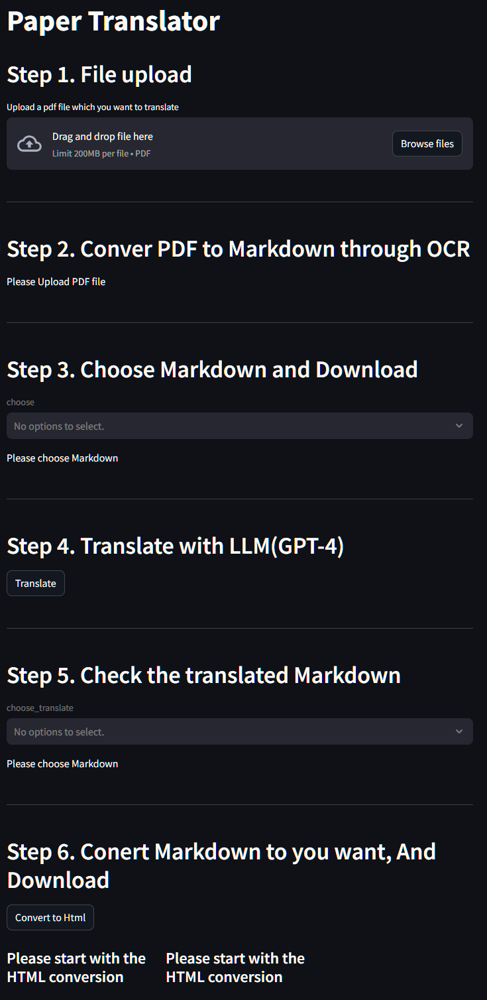
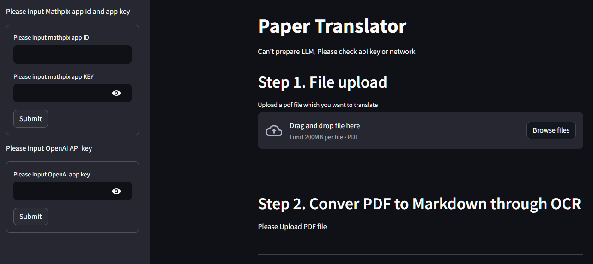

# Paper_translator Version. 0.7.0

-   Paper Translator is a code that translates academic papers using mathpix and chatGPT APIs. It was developed to address various issues such as a significant drop in translation quality and reduced readability of equations that occur when academic papers are fully translated through services like DeepL or Google Translator.
-   When fully translating a paper, a major factor that reduces readability is the improper OCR recognition of images and equations, leading to issues when recreating the document post-translation. Mathpix excels in the OCR process by accurately recognizing images and equations, and converting them into high-quality Latex or Markdown. Additionally, when an article contains equations, the fundamental idea of this code is to use GPT-4, which translates the article more effectively if it includes equations represented in Latex, rather than just the text converted from equations.

### Gui Version release!(by Streamlit)



## 1. Prepare

### 1) API key

-   Initially, two key preparations are required: the API keys for Mathpix and OpenAI. It's important to note that both services operate a paid membership system for web-based services and a separate API account system. Although the registration process is the same, care is needed as the paid membership and the API payment system are distinct in the payment system. To use this code, one must utilize the paid API payment system, not just be a paid member.
-   After registering on https://mathpix.com/, you can obtain the App_ID and App_key by going to your account and creating an API key through 'create api key'.
-   For GPT as well, after registering at https://openai.com/, you move to the API section to prepare for using the API key, and then you can obtain the key.

## 2. How it works

### 1) Installation

-   Firstly, you may choose to create a virtual environment or not, but using a virtual environment is recommended. As for the Python version, the development was done on version 3.11.7, and it is believed that any version above 3.11.7 should work without major issues.

-   Next, copy the git repository to your local environment.

```shell
$ git clone https://github.com/aeolian83/paper_translator.git
```

-   Install the requirements using pip.

```shell
$ pip install -r requirements.txt
```

#### \*Troubleshooting Dependencies

-   There is a high likelihood of encountering issues on some systems due to weasyprint dependency problems. In such cases, following the installation process detailed in the official documentation of weasyprint can resolve the issue. [[Page Link](https://doc.courtbouillon.org/weasyprint/stable/first_steps.html#installation)]

-   On some Linux systems, there might be a failure to load necessary libraries, leading to an error message `cannot load library 'gobject-2.0-0'`. This can be resolved by installing the "GTK" library. For Anaconda virtual environments, it can be installed using the following command.

```shell
$ conda install -c conda-forge gtk3
```

### 2) API KEY setting

1. You can enter it through the GUI without having to set the API key.
   
2. Make Streamlit Secret environment file `./streamlit/secret.toml`
3. In that file write down below

```
# openai
OPENAI_API_KEY = "Your api key"

# mathpixh
mathpix_app_id = "Your api ID"
mathpix_app_key = "Your api key"
```

### 3) Execute

```shell
$ streamlit run home.py
```

## 3. Versions

### (1) legacy 0.4

-   First Version

### (2) legacy 0.4 -> 0.4.2 Changes

-   During the translation process, issues arose from omitting image insertion commands and directly translating certain technical terms, reducing readability. Thus, the prompt has been revised to shift from zero-shot to few-shot. Additionally, in the OCR process using Mathpix, there were issues with the proper recognition of tables, so modifications have been made to improve recognition accuracy in that aspect.

### (3) Gui Version 0.7

-   I've created a GUI version using Streamlit, which features the following:

    -   You can enter the API key directly using the Streamlit configuration file, and it's also possible to input it through the GUI.
    -   The process consists of six steps: upload -> OCR to markdown -> select markdown for translation -> translate -> check translation status -> file conversion and download. You can download the file at each step of the process.
    -   Components related to running the LLM are built through Langchain, making them easy to modify.

-   Langchain was used for prompt building and running the LLM model.

-   To solve the issue of reduced table readability when converting to PDF, BeautifulSoup was used to modify some of the CSS styles embedded in the HTML file.

### (4) Future work

-   Simplification of LLM Prompts reduce API costs.
-   A feature to check the entire prompt entered into the LLM for error verification
-   A feature to check grouped chunks
-   Implement translation code using googles'gemini API or an open-source LLM to reduce API costs.

## 4. Precautions

## 5. Reference

-   https://platform.openai.com/tokenizer
-   https://github.com/openai/openai-cookbook/blob/main/examples/book_translation/translate_latex_book.ipynb
-   https://docs.mathpix.com/#introduction
-   https://jimmy-ai.tistory.com/399
